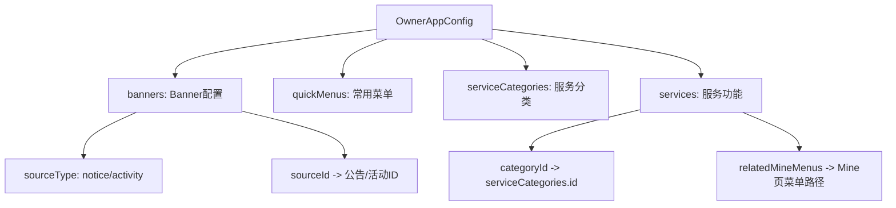
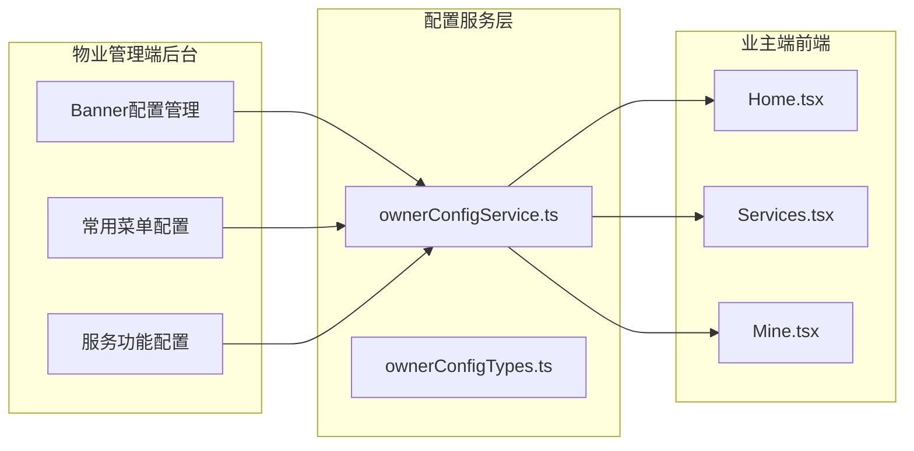

# 业主端配置化管理设计方案

## 1. 概述

将业主端（微信 H5）的功能改造为可配置项，在物业管理端后台提供统一的配置管理界面。所有配置存放在独立的 **业主端管理** 模块下，支持二级菜单扩展。

---

## 2. 数据模型

### 2.1 类型定义文件
**新建文件**: [`property-management-system/src/services/ownerConfigTypes.ts`](property-management-system/src/services/ownerConfigTypes.ts)

```typescript
// Banner配置项 - 引用社区公告或活动
export interface OwnerBannerConfig {
  id: number;
  sourceType: 'notice' | 'activity';  // 来源类型
  sourceId: number;                    // 公告或活动的ID
  title: string;                       // 展示标题
  subtitle: string;                    // 副标题
  gradient: string;                    // 渐变色
  emoji: string;                       // 图标
  sortOrder: number;                   // 排序
  enabled: boolean;                    // 是否启用
}

// 常用菜单配置项
export interface OwnerQuickMenuConfig {
  id: number;
  label: string;          // 菜单名称
  icon: string;           // 图标emoji
  path: string;           // 路由路径
  sortOrder: number;      // 排序号
  enabled: boolean;       // 是否启用
  color: string;          // 图标颜色
  bg: string;             // 背景色
}

// 服务功能配置项
export interface OwnerServiceConfig {
  id: number;
  categoryId: number;     // 所属分类ID
  icon: string;           // 图标emoji
  label: string;          // 服务名称
  path: string;           // 路由路径
  desc: string;           // 描述
  sortOrder: number;      // 排序号
  enabled: boolean;       // 是否启用
  relatedMineMenus: string[];  // 关联的"我的"菜单路径列表
}

// 服务分类配置
export interface OwnerServiceCategoryConfig {
  id: number;
  title: string;          // 分类名称
  emoji: string;          // 分类图标
  color: string;          // 主题色
  bg: string;             // 背景色
  sortOrder: number;      // 排序号
  enabled: boolean;       // 是否启用
}

// 整体配置
export interface OwnerAppConfig {
  banners: OwnerBannerConfig[];
  quickMenus: OwnerQuickMenuConfig[];
  serviceCategories: OwnerServiceCategoryConfig[];
  services: OwnerServiceConfig[];
}
```

### 2.2 数据关系图



---

## 3. 服务层设计

**新建文件**: [`property-management-system/src/services/ownerConfigService.ts`](property-management-system/src/services/ownerConfigService.ts)

| 方法 | 说明 |
|------|------|
| `getOwnerConfig()` | 获取完整业主端配置 |
| `getEnabledBanners()` | 获取已启用的Banner列表 |
| `getEnabledQuickMenus()` | 获取已启用的常用菜单（按排序） |
| `getEnabledServiceCategories()` | 获取已启用的服务分类 |
| `getEnabledServices()` | 获取已启用的服务功能 |
| `getEnabledMineMenus()` | 获取已启用的"我的"菜单（基于服务配置） |
| `updateBannerConfig(items)` | 更新Banner配置 |
| `updateQuickMenus(items)` | 更新常用菜单配置 |
| `updateServiceCategories(items)` | 更新服务分类配置 |
| `updateServices(items)` | 更新服务功能配置 |
| `resetToDefaults()` | 重置为默认配置 |

**数据流架构**:



---

## 4. 物业管理端后台页面

### 4.1 Banner配置管理
**新建文件**: [`property-management-system/src/pages/property/BannerConfigManage.tsx`](property-management-system/src/pages/property/BannerConfigManage.tsx)

- 表格展示所有已配置的Banner项
- 支持从社区公告/活动中选择置顶内容
- 支持拖拽排序
- 支持启用/禁用开关
- 支持删除配置项

### 4.2 常用菜单配置
**新建文件**: [`property-management-system/src/pages/property/QuickMenuConfig.tsx`](property-management-system/src/pages/property/QuickMenuConfig.tsx)

- 表格展示所有8个常用菜单项
- 每行可编辑：名称、图标（emoji选择器）、路由路径、排序号
- 启用/禁用开关
- 拖拽排序
- 支持重置为默认配置

### 4.3 服务功能配置
**新建文件**: [`property-management-system/src/pages/property/ServiceConfigManage.tsx`](property-management-system/src/pages/property/ServiceConfigManage.tsx)

- 分两个区域：
  - **服务分类配置**：展示所有分类，支持启用/禁用、排序
  - **服务功能配置**：展示所有服务项，支持启用/禁用、排序
- 每个服务项可配置关联的"我的"菜单路径
- 支持批量操作

### 4.4 页面布局

```mermaid
flowchart TD
    subgraph Menu[物业管理端菜单]
        OwnerConfig[业主端管理]
    end
    
    subgraph SubMenus[二级菜单]
        BannerConfig[Banner配置管理]
        QuickMenu[常用菜单配置]
        ServiceConfig[服务功能配置]
    end
    
    OwnerConfig --> BannerConfig
    OwnerConfig --> QuickMenu
    OwnerConfig --> ServiceConfig
    
    BannerConfig --> Route1[/property/owner-config/banner]
    QuickMenu --> Route2[/property/owner-config/quick-menu]
    ServiceConfig --> Route3[/property/owner-config/service]
```

---

## 5. 业主端前端改造

### 5.1 Home.tsx 改造
**修改文件**: [`property-management-system/src/pages/owner/Home.tsx`](property-management-system/src/pages/owner/Home.tsx)

**变更点**:
- 导入 `getEnabledBanners()` 替代硬编码的 `bannerData`
- 导入 `getEnabledQuickMenus()` 替代硬编码的 `quickActions`
- 如果配置为空，使用默认值作为降级方案

```typescript
// 改造后
import { getEnabledBanners, getEnabledQuickMenus } from '../../services/ownerConfigService';

// 在组件内
const bannerData = getEnabledBanners();
const quickActions = getEnabledQuickMenus();
```

### 5.2 Services.tsx 改造
**修改文件**: [`property-management-system/src/pages/owner/Services.tsx`](property-management-system/src/pages/owner/Services.tsx)

**变更点**:
- 导入 `getEnabledServiceCategories()` 和 `getEnabledServices()`
- 根据配置过滤分类和服务项
- 只展示已启用的分类和其下已启用的服务

```typescript
// 改造后
import { getEnabledServiceCategories, getEnabledServices } from '../../services/ownerConfigService';

const categories = getEnabledServiceCategories();
const allServices = getEnabledServices();

// 渲染时按分类分组，只显示该分类下启用的服务
categories.map(cat => {
  const catServices = allServices.filter(s => s.categoryId === cat.id);
  // 渲染...
});
```

### 5.3 Mine.tsx 改造
**修改文件**: [`property-management-system/src/pages/owner/Mine.tsx`](property-management-system/src/pages/owner/Mine.tsx)

**变更点**:
- 导入 `getEnabledServices()` 获取启用的服务列表
- 从启用的服务中提取关联的"我的"菜单路径
- 只展示在服务配置中启用了关联的"我的"菜单项

```typescript
// 改造后
import { getEnabledServices } from '../../services/ownerConfigService';

const enabledServices = getEnabledServices();
// 从启用的服务中提取关联的"我的"菜单
const enabledMinePaths = enabledServices
  .flatMap(s => s.relatedMineMenus);

// 过滤 myServices，只显示启用的
const filteredMyServices = myServices.filter(
  s => enabledMinePaths.includes(s.path)
);
```

---

## 6. 菜单与路由变更

### 6.1 menuConfig.ts 变更
**修改文件**: [`property-management-system/src/utils/menuConfig.ts`](property-management-system/src/utils/menuConfig.ts)

在 `propertyMenus` 数组中新增菜单项：

```typescript
{
  key: 'owner-config',
  label: '业主端管理',
  icon: 'AppstoreOutlined',
  children: [
    { key: 'owner-banner', label: 'Banner配置管理', path: '/property/owner-config/banner' },
    { key: 'owner-quick-menu', label: '常用菜单配置', path: '/property/owner-config/quick-menu' },
    { key: 'owner-service', label: '服务功能配置', path: '/property/owner-config/service' },
  ]
},
```

### 6.2 router/index.tsx 变更
**修改文件**: [`property-management-system/src/router/index.tsx`](property-management-system/src/router/index.tsx)

在 `/property` 路由的 `children` 中新增：

```typescript
// 业主端管理
{ path: 'owner-config/banner', element: <BannerConfigManage /> },
{ path: 'owner-config/quick-menu', element: <QuickMenuConfig /> },
{ path: 'owner-config/service', element: <ServiceConfigManage /> },
```

新增导入：

```typescript
import BannerConfigManage from '../pages/property/BannerConfigManage';
import QuickMenuConfig from '../pages/property/QuickMenuConfig';
import ServiceConfigManage from '../pages/property/ServiceConfigManage';
```

---

## 7. 图标映射补充

在 [`router/index.tsx`](property-management-system/src/router/index.tsx) 的 `iconMap` 中补充：

```typescript
AppstoreOutlined: <AppstoreOutlined />,  // 已有
```

`AppstoreOutlined` 已在 `iconMap` 中存在，无需新增。

---

## 8. 实施步骤

| 步骤 | 文件 | 操作 | 说明 |
|------|------|------|------|
| 1 | `ownerConfigTypes.ts` | 新建 | 定义所有配置类型 |
| 2 | `ownerConfigService.ts` | 新建 | 实现配置CRUD服务层 |
| 3 | `BannerConfigManage.tsx` | 新建 | Banner配置管理页面 |
| 4 | `QuickMenuConfig.tsx` | 新建 | 常用菜单配置页面 |
| 5 | `ServiceConfigManage.tsx` | 新建 | 服务功能配置页面 |
| 6 | `menuConfig.ts` | 修改 | 添加业主端管理菜单 |
| 7 | `router/index.tsx` | 修改 | 添加路由和导入 |
| 8 | `Home.tsx` | 修改 | 接入配置服务 |
| 9 | `Services.tsx` | 修改 | 接入配置服务 |
| 10 | `Mine.tsx` | 修改 | 接入配置服务 |
| 11 | 构建验证 | 执行 | `npm run build` 验证 |

---

## 9. 扩展性说明

- **新增配置项**：只需在 `OwnerAppConfig` 中添加新字段，在 `ownerConfigService.ts` 中添加对应方法
- **新增二级菜单**：在 `menuConfig.ts` 的 `owner-config` 下新增 `children` 项，在路由中添加对应页面
- **新增业主端页面**：在 `ownerConfigTypes.ts` 中定义配置类型，在后台页面添加配置界面，在业主端页面读取配置
