# 员工档案与账号管理重构方案

## 一、问题分析

### 1.1 当前问题

1. **概念混淆**：菜单叫"人员列表"，实际管理的是登录账号（含密码、角色、权限），不是员工档案
2. **数据脱节**：值班排班的 `getStaffList()` 使用独立的硬编码 `mockStaffList`，与 `User` 表完全无关
3. **缺少员工属性**：排班需要知道"哪些人可以排班、什么岗位、有什么技能"，当前 `User` 模型没有这些字段
4. **多端共用账号**：`User` 表同时服务于 property/government/merchant/owner/superadmin 五个端，员工档案只应针对物业端

### 1.2 竞品做法

| 竞品 | 员工档案 | 账号管理 | 排班选人 |
|------|---------|---------|---------|
| 千丁云 | 独立模块，含工号/部门/岗位/技能 | 系统设置下 | 从员工档案选 |
| 彩生活 | 独立模块，含人事信息 | 系统设置下 | 从员工档案选 |
| 万科住这儿 | 人员管理=员工档案 | 账号是员工属性 | 从员工档案选 |
| 物业帮 | 人事档案（含合同/社保） | 系统登录权限 | 从员工档案选 |

---

## 二、数据模型设计

### 2.1 新增 EmployeeProfile

```typescript
// 员工档案（仅物业管理端使用）
interface EmployeeProfile {
  id: number;
  userId: number | null;     // 关联 User.id（可选，支持无账号员工）
  employeeNo: string;        // 工号
  realName: string;          // 姓名（优先使用，无账号员工必填）
  phone: string;             // 手机号（无账号员工必填）
  department: string;        // 部门：工程部/安保部/客服部/财务部/行政部
  position: string;          // 岗位：维修工/保安/客服/会计/项目经理
  entryDate: string;         // 入职日期
  skillTags: string[];       // 技能标签
  canSchedule: boolean;      // 是否参与排班（默认 true）
  status: 'active' | 'resigned' | 'leave';  // 在职状态
  createdAt: string;
  updatedAt: string;
}
```

### 2.2 关联关系

```mermaid
erDiagram
    User ||--o| EmployeeProfile : "可选关联"
    EmployeeProfile ||--o{ DutySchedule : "staffIds引用"
    EmployeeProfile ||--o{ ScheduleTemplate : "staffIds引用"
    
    User {
        int id PK
        string phone "登录手机号"
        string password "密码"
        string realName "真实姓名"
        string portType "所属端: property/government/merchant/owner/superadmin"
        int status "1启用 0禁用"
    }
    
    EmployeeProfile {
        int id PK
        int userId FK "关联User.id, nullable"
        string employeeNo "工号"
        string department "部门"
        string position "岗位"
        boolean canSchedule "是否参与排班"
        string status "active/resigned/leave"
    }
    
    DutySchedule {
        string id PK
        string date "日期"
        string shift "班次"
        int[] staffIds "员工档案ID列表"
        int leaderId "值班组长ID"
    }
```



### 2.3 关键业务规则

1. **创建员工档案时**：
   - 可选关联 User（从 `portType='property'` 的用户中选择）
   - 一个 User 只能关联一个 EmployeeProfile
   - 不关联账号的员工需填写姓名和手机号

2. **值班排班选人时**：
   - 从 EmployeeProfile 筛选 `canSchedule=true` 且 `status='active'`
   - 如果关联了 User，同时检查 User.status（账号禁用时标记警告）
   - 显示姓名优先用 EmployeeProfile.realName

3. **账号禁用/删除时**：
   - 不影响 EmployeeProfile 的存在
   - 排班选择时显示"该员工账号已禁用"标记

---

## 三、菜单结构调整

### 当前菜单
```
物业管理端
  ├── 人员管理
  │   ├── 人员列表 ← 实际是账号管理
  │   ├── 新增人员
  │   └── 编辑人员
  ├── 角色管理
  └── 组织架构管理
```

### 重构后菜单
```
物业管理端
  ├── 人员管理
  │   ├── 员工档案 ← 新增
  │   ├── 岗位管理 ← 新增
  │   └── 排班设置 ← 新增（可选）
  ├── 系统管理
  │   ├── 账号管理 ← 从"人员列表"改名迁移
  │   ├── 角色管理
  │   └── 组织架构管理
```

---

## 四、实施步骤

### Step 1：数据层

**文件：** [`property-management-system/src/services/types.ts`](property-management-system/src/services/types.ts)

- 新增 `EmployeeProfile` 接口
- 新增 `Department` 和 `Position` 类型（部门/岗位枚举）

**文件：** [`property-management-system/src/services/employeeService.ts`](property-management-system/src/services/employeeService.ts)（新建）

- `getEmployeeList(params?)` — 获取员工档案列表
- `getEmployeeById(id)` — 获取单个员工
- `createEmployee(data)` — 新增员工档案
- `updateEmployee(id, data)` — 更新员工档案
- `deleteEmployee(id)` — 删除员工档案
- `getAvailableUsers()` — 获取可关联的物业端用户列表（`portType='property'` 且未关联员工档案的 User）
- Mock 数据：将原 `mockStaffList` 迁移为 EmployeeProfile 数据

**文件：** [`property-management-system/src/services/dailyService.ts`](property-management-system/src/services/dailyService.ts)

- 修改 `getStaffList()` 改为从 EmployeeProfile 查询（`canSchedule=true` 且 `status='active'`）
- 修改 `DutySchedule.staffIds` 和 `ScheduleTemplate.staffIds` 类型从 `string[]` 改为 `number[]`

### Step 2：页面层

**文件：** [`property-management-system/src/pages/property/EmployeeManage.tsx`](property-management-system/src/pages/property/EmployeeManage.tsx)（新建）

- 员工档案列表页（Table）
- 新增/编辑弹窗（Modal + Form）
- 字段：姓名、手机号、工号、部门、岗位、入职日期、技能标签、是否参与排班、关联账号
- 关联账号选择器：从 `getAvailableUsers()` 获取可选用户列表
- 离职操作：将 status 改为 'resigned'

**文件：** [`property-management-system/src/pages/property/PositionManage.tsx`](property-management-system/src/pages/property/PositionManage.tsx)（新建）

- 部门/岗位管理（简单的 CRUD 表格）
- 预设数据：工程部/安保部/客服部/财务部/行政部

**文件：** [`property-management-system/src/pages/property/StaffList.tsx`](property-management-system/src/pages/property/StaffList.tsx)（修改）

- 页面标题改为"账号管理"
- 内容不变（仍然是 User 管理）

### Step 3：路由和菜单

**文件：** [`property-management-system/src/router/index.tsx`](property-management-system/src/router/index.tsx)

- 添加路由：`/property/staff/employee` → EmployeeManage
- 添加路由：`/property/staff/position` → PositionManage

**文件：** [`property-management-system/src/utils/menuConfig.ts`](property-management-system/src/utils/menuConfig.ts)

- 在"人员管理"下添加"员工档案"和"岗位管理"子菜单
- 将"人员列表"改名为"账号管理"

### Step 4：值班排班适配

**文件：** [`property-management-system/src/pages/property/ScheduleManage.tsx`](property-management-system/src/pages/property/ScheduleManage.tsx)

- 人员选择器改为从 `employeeService.getEmployeeList({ canSchedule: true })` 加载
- 排班记录中的 `staffIds` 和 `leaderId` 改为引用 EmployeeProfile.id
- 显示员工姓名时，如果关联了 User 且 User.status=0，显示"⚠️ 账号已禁用"标记

---

## 五、数据迁移说明

### 原 mockStaffList → 新 EmployeeProfile Mock 数据

```typescript
const mockEmployees: EmployeeProfile[] = [
  { id: 1, userId: 4,  employeeNo: 'EMP001', realName: '王师傅',  phone: '13800000004', department: '工程部', position: '维修工',  entryDate: '2026-01-20', skillTags: ['水电', '电梯'],     canSchedule: true,  status: 'active' },
  { id: 2, userId: 5,  employeeNo: 'EMP002', realName: '赵保安',  phone: '13800000005', department: '安保部', position: '保安',    entryDate: '2026-02-01', skillTags: ['巡逻', '消防'],     canSchedule: true,  status: 'active' },
  { id: 3, userId: 3,  employeeNo: 'EMP003', realName: '李明霞',  phone: '13800000003', department: '客服部', position: '客服',    entryDate: '2026-01-15', skillTags: ['投诉处理', '接待'], canSchedule: false, status: 'active' },
  { id: 4, userId: null, employeeNo: 'EMP004', realName: '刘保洁', phone: '13800000007', department: '保洁部', position: '保洁员',  entryDate: '2026-03-01', skillTags: ['清洁'],             canSchedule: true,  status: 'active' },
  { id: 5, userId: 6,  employeeNo: 'EMP005', realName: '刘会计',  phone: '13800000006', department: '财务部', position: '会计',    entryDate: '2026-02-01', skillTags: ['财务'],             canSchedule: false, status: 'active' },
];
```

注意：
- 原 `mockStaffList` 的 `s1`~`s6` 映射到新 EmployeeProfile 的 `id: 1~6`
- 原排班数据中的 `staffIds: ['s1', 's2']` 改为 `staffIds: [1, 2]`
- 李明霞（客服）和刘会计（财务）设置 `canSchedule=false`，不参与排班
- 刘保洁没有关联账号（userId=null），但仍可参与排班

---

## 六、涉及文件清单

| 文件 | 操作 | 说明 |
|------|------|------|
| `src/services/types.ts` | 修改 | 新增 EmployeeProfile 接口 |
| `src/services/employeeService.ts` | 新建 | 员工档案 CRUD 服务 |
| `src/services/dailyService.ts` | 修改 | getStaffList 改为从 EmployeeProfile 查询 |
| `src/pages/property/EmployeeManage.tsx` | 新建 | 员工档案管理页面 |
| `src/pages/property/PositionManage.tsx` | 新建 | 岗位管理页面 |
| `src/pages/property/StaffList.tsx` | 修改 | 标题改为"账号管理" |
| `src/pages/property/ScheduleManage.tsx` | 修改 | 人员选择器适配 EmployeeProfile |
| `src/router/index.tsx` | 修改 | 添加新路由 |
| `src/utils/menuConfig.ts` | 修改 | 调整菜单结构 |
