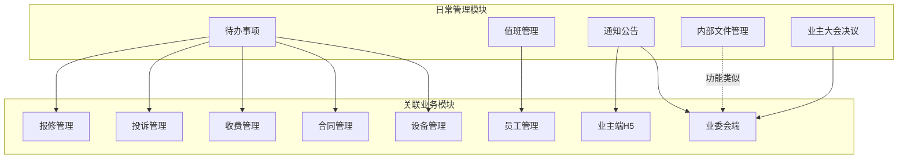
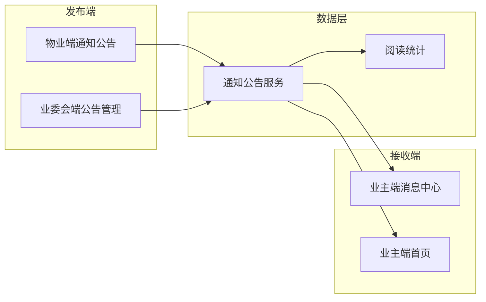
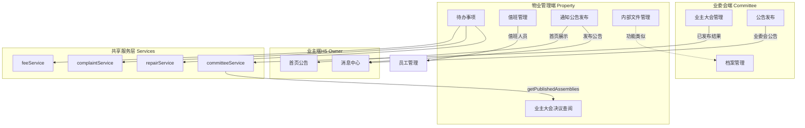

# 物业管理端 - 日常管理模块需求说明

## 版本记录

| 版本 | 日期 | 作者 | 变更内容 |
|------|------|------|----------|
| V1.0 | 2026-05-06 | Roo | 初始版本，完整需求说明 |

---

## 一、需求概述

日常管理模块是物业管理端最核心的运营支撑模块，涵盖物业公司日常运营所需的**待办事项管理、值班排班、通知公告发布、内部文件管理、业主大会决议查阅**五大功能。该模块是物业公司员工每天使用频率最高的模块，直接关系到物业运营效率和服务质量。

### 1.1 当前状态

| 子功能 | 菜单路径 | 当前状态 | 说明 |
|--------|----------|----------|------|
| 待办事项 | `/property/daily/todo` | ❌ 未实现 | 占位页面 |
| 值班管理 | `/property/daily/schedule` | ❌ 未实现 | 占位页面 |
| 通知公告 | `/property/daily/notice` | ❌ 未实现 | 占位页面 |
| 内部文件 | `/property/daily/document` | ❌ 未实现 | 占位页面 |
| 业主大会决议 | `/property/daily/assembly-resolution` | ✅ 已实现 | 刚完成开发 |

### 1.2 菜单结构

```typescript
// 日常管理菜单（menuConfig.ts 第358-370行）
{
  key: 'daily',
  label: '日常管理',
  icon: 'ScheduleOutlined',
  children: [
    { key: 'todo', label: '待办事项', path: '/property/daily/todo' },
    { key: 'schedule', label: '值班管理', path: '/property/daily/schedule' },
    { key: 'notice', label: '通知公告', path: '/property/daily/notice' },
    { key: 'document', label: '内部文件', path: '/property/daily/document' },
    { key: 'assembly-resolution', label: '业主大会决议', path: '/property/daily/assembly-resolution' },
  ]
}
```

---

## 二、功能模块总览



---

## 三、子功能详细说明

### 3.1 待办事项

#### 3.1.1 需求概述

待办事项是物业人员的统一工作台看板，聚合展示各业务模块中需要当前用户处理的任务，提供快捷入口直达处理页面。

#### 3.1.2 页面结构

```
待办事项
├── 待办看板（统计卡片）
│   ├── 待处理报修（数量 + 快捷跳转至报修管理）
│   ├── 待处理投诉（数量 + 快捷跳转至投诉管理）
│   ├── 待审核装修（数量 + 快捷跳转至装修审核）
│   ├── 待处理建议（数量 + 快捷跳转至业主建议）
│   ├── 即将到期合同（数量 + 快捷跳转至合同管理）
│   └── 今日巡检任务（数量 + 快捷跳转至设备巡检）
├── 待办列表
│   ├── 按时间倒序排列
│   ├── 每条待办显示：来源模块、标题、提交人、提交时间、紧急程度
│   ├── 点击跳转到对应处理页面
│   └── 支持标记为已处理
├── 快捷操作
│   ├── 发布通知公告
│   ├── 新建报修工单
│   └── 查看运营报表
└── 最近动态
    ├── 最新投诉/报修/工单动态（实时滚动）
    └── 系统通知
```

#### 3.1.3 交互流程

1. 页面加载时，自动从各业务模块拉取待办数据
2. 统计卡片显示各类待办数量，点击跳转到对应管理页面
3. 待办列表支持按模块筛选、按紧急程度排序
4. 每条待办支持「标记完成」操作
5. 快捷操作为常用功能的快速入口

#### 3.1.4 数据来源

| 待办类型 | 数据来源 | 关联状态 | 跳转目标 |
|----------|----------|----------|----------|
| 待处理报修 | `repairService.ts` | `pending_accept`, `assigned` | `/property/repair` |
| 待处理投诉 | `complaintService.ts` | `pending_accept`, `assigned` | `/property/complaint` |
| 待审核装修 | 装修管理模块 | `pending_review` | `/property/decoration` |
| 即将到期合同 | 合同管理模块 | 到期前30天 | `/property/contract` |
| 今日巡检任务 | 设备管理模块 | 今日待巡检 | `/property/device/inspect-task` |
| 待执行决议 | 业主大会决议 | `published` 且未执行 | `/property/daily/assembly-resolution` |

#### 3.1.5 数据字段

```typescript
interface TodoItem {
  id: string;
  module: 'repair' | 'complaint' | 'decoration' | 'contract' | 'inspect' | 'resolution';
  title: string;
  description?: string;
  submitter: string;
  submitTime: string;
  urgency: 'normal' | 'urgent' | 'emergency';
  status: 'pending' | 'processing' | 'completed';
  targetPath: string; // 跳转路径
  relatedId: string;  // 关联业务ID
}

interface TodoStats {
  pendingRepairs: number;
  pendingComplaints: number;
  pendingDecorations: number;
  pendingSuggestions: number;
  expiringContracts: number;
  todayInspectTasks: number;
}
```

---

### 3.2 值班管理

#### 3.2.1 需求概述

为物业公司提供值班排班管理功能，支持排班模板设置、自动排班、手动调整、交接班记录和值班统计。

#### 3.2.2 页面结构

```
值班管理
├── 值班日历（月视图/周视图切换）
│   ├── 每日显示值班人员名单
│   ├── 值班组长标识（星标）
│   ├── 班次颜色区分（早班/中班/晚班）
│   └── 点击日期查看详情
├── 排班管理
│   ├── 排班模板设置
│   │   ├── 早班模板（人员配置）
│   │   ├── 中班模板（人员配置）
│   │   └── 晚班模板（人员配置）
│   ├── 自动排班（按模板生成月度排班）
│   └── 手动调整（拖拽换班/调休）
├── 交接班记录
│   ├── 交接班时间记录
│   ├── 交接事项清单
│   ├── 待办任务移交
│   └── 双方电子签名确认
└── 值班统计
    ├── 个人值班统计（值班天数/出勤率）
    └── 月度出勤率统计
```

#### 3.2.3 交互流程

1. 默认展示当月值班日历（月视图）
2. 点击日期可查看该日详细值班信息
3. 排班管理支持「从模板生成」一键排班
4. 手动调整支持拖拽交换班次
5. 交接班时，交班人填写交接事项，接班人确认
6. 值班统计按月统计，支持导出

#### 3.2.4 业务关联

- **员工管理**：值班人员数据来源于员工档案（`StaffList.tsx`），排班时从员工列表选择
- **考勤管理**：值班统计可作为考勤考核依据
- **待办事项**：今日值班信息展示在待办看板中

#### 3.2.5 数据字段

```typescript
// 排班模板
interface ScheduleTemplate {
  id: string;
  name: string;
  shiftType: 'morning' | 'afternoon' | 'night';
  staffIds: string[];
  leaderId: string;
}

// 值班排班
interface DutySchedule {
  id: string;
  date: string;
  shift: 'morning' | 'afternoon' | 'night';
  staffIds: string[];
  leaderId: string;
  note?: string;
  createdBy: string;
  createdAt: string;
}

// 交接班记录
interface HandoverRecord {
  id: string;
  scheduleId: string;
  handoverStaff: string;    // 交班人
  takeoverStaff: string;    // 接班人
  handoverTime: string;
  takeoverTime?: string;
  items: HandoverItem[];    // 交接事项
  pendingTodos: string[];   // 待办移交
  status: 'pending' | 'confirmed';
  handoverSign?: string;    // 交班签名
  takeoverSign?: string;    // 接班签名
}

interface HandoverItem {
  content: string;
  priority: 'normal' | 'important' | 'urgent';
  resolved: boolean;
}

// 值班统计
interface DutyStats {
  staffId: string;
  staffName: string;
  totalDutyDays: number;
  attendanceRate: number;
  lateCount: number;
  earlyLeaveCount: number;
  month: string;
}
```

---

### 3.3 通知公告

#### 3.3.1 需求概述

物业公司向业主发布通知公告的核心渠道，支持富文本编辑、发布范围控制、置顶设置、定时发布和阅读统计。

#### 3.3.2 页面结构

```
通知公告
├── 发布公告
│   ├── 标题（必填）
│   ├── 内容（富文本编辑器，使用 RichTextEditor 组件）
│   ├── 发布范围
│   │   ├── 全部业主
│   │   ├── 指定楼栋
│   │   └── 指定单元
│   ├── 置顶设置（开关）
│   ├── 附件上传（支持多文件）
│   └── 发布方式
│       ├── 立即发布
│       └── 定时发布（选择发布时间）
├── 公告列表
│   ├── Tab 切换：已发布 / 草稿 / 定时发布
│   ├── 列表字段：标题、发布范围、状态、发布时间、阅读量
│   └── 操作：查看、编辑、删除、撤回
├── 阅读统计
│   ├── 已读/未读数量统计
│   ├── 已读详情列表（谁读了、阅读时间）
│   └── 未读业主列表（支持一键催读）
└── 公告模板
    ├── 常用模板管理（新增/编辑/删除）
    └── 从模板快速发布
```

#### 3.3.3 交互流程

1. 点击「发布公告」打开编辑弹窗/页面
2. 填写标题、内容（富文本）、选择发布范围
3. 可选上传附件、设置置顶、定时发布
4. 发布后，业主端（`OwnerNotice.tsx`）实时收到通知
5. 发布人可在列表中查看阅读统计
6. 支持撤回已发布公告（撤回后业主端不可见）

#### 3.3.4 业务关联



- **业主端消息中心**（`OwnerNotice.tsx`）：业主在 H5 端查看物业/业委会发布的公告
- **业主端首页**（`OwnerHome.tsx`）：首页展示最新公告列表
- **业委会端公告管理**（`NoticeManage.tsx`）：业委会也可发布公告，同样推送到业主端
- **通知公告类型区分**：
  - 物业端发布：物业通知、缴费提醒、活动通知
  - 业委会发布：业委会公告、业主大会通知、公示公告

#### 3.3.5 数据字段

```typescript
interface Announcement {
  id: string;
  title: string;
  content: string;              // 富文本 HTML
  scope: 'all' | 'building' | 'unit';
  scopeValue?: string;          // 楼栋ID/单元ID
  isTop: boolean;
  attachments: AnnouncementAttachment[];
  status: 'draft' | 'published' | 'scheduled' | 'withdrawn';
  publishTime: string;          // 立即发布=当前时间，定时发布=设定时间
  readCount: number;
  totalTarget: number;          // 目标阅读人数
  createdBy: string;
  createdAt: string;
  updatedAt: string;
  source: 'property' | 'committee'; // 发布来源
}

interface AnnouncementAttachment {
  name: string;
  url: string;
  size: number;
  type: string;
}

interface ReadRecord {
  announcementId: string;
  ownerId: string;
  ownerName: string;
  houseAddress: string;
  readTime: string;
}
```

---

### 3.4 内部文件管理

#### 3.4.1 需求概述

为物业公司提供内部文件存储、分类、检索功能，支持目录树结构、文件上传下载、权限控制。

#### 3.4.2 页面结构

```
内部文件管理
├── 左侧：文件目录树
│   ├── 公司制度
│   │   ├── 人事制度
│   │   ├── 财务制度
│   │   └── 运营制度
│   ├── 操作手册
│   │   ├── 保洁操作规范
│   │   ├── 保安巡逻流程
│   │   └── 设备维护手册
│   ├── 培训资料
│   ├── 会议纪要
│   └── 自定义文件夹（支持新增/编辑/删除）
├── 右侧：文件列表
│   ├── 文件名
│   ├── 文件类型图标（PDF/Word/Excel/图片）
│   ├── 上传人
│   ├── 上传时间
│   ├── 文件大小
│   ├── 下载次数
│   └── 操作（下载/重命名/移动/删除）
├── 文件上传
│   ├── 拖拽上传区域
│   ├── 点击选择文件
│   └── 选择存放目录
└── 文件搜索
    ├── 按文件名搜索
    └── 按文件类型筛选
```

#### 3.4.3 交互流程

1. 左侧目录树展示文件分类结构，支持展开/折叠
2. 点击目录节点，右侧显示该目录下的文件列表
3. 支持新建子目录、重命名目录、删除目录
4. 文件上传支持拖拽和点击选择两种方式
5. 文件列表支持排序（按时间/名称/大小）
6. 搜索功能实时过滤文件名

#### 3.4.4 业务关联

- **业委会档案管理**（`ArchiveManage.tsx`）：功能类似但数据隔离，业委会管理的是小区档案（合同、图纸、证件等），物业端管理的是内部运营文件
- **员工培训**：培训资料目录下的文件可用于员工培训考核
- **通知公告附件**：发布通知时可从文件库选择附件

#### 3.4.5 数据字段

```typescript
interface FileDirectory {
  id: string;
  name: string;
  parentId: string | null;
  sortOrder: number;
  createdBy: string;
  createdAt: string;
}

interface InternalFile {
  id: string;
  name: string;
  directoryId: string;
  fileType: 'pdf' | 'word' | 'excel' | 'image' | 'other';
  fileUrl: string;
  fileSize: number;
  uploader: string;
  uploadedAt: string;
  downloadCount: number;
  description?: string;
}
```

---

### 3.5 业主大会决议

#### 3.5.1 需求概述

**已实现**。展示业委会已发布结果的业主大会决议，供物业公司查阅和执行。仅展示已结束并发布结果的大会，物业端为只读权限。

#### 3.5.2 功能说明

- 统计卡片：总决议数、平均参与率、待执行事项
- 决议列表：标题、类型、投票时间、议题数、参与率
- 详情弹窗：按议题展示投票结果（Progress 进度条 + 通过/未通过标签）
- 已发布标识：显示"此决议已由业委会正式发布，请物业公司按决议内容执行"

#### 3.5.3 业务关联

- **业委会端业主大会管理**（`AssemblyManage.tsx`）：数据源，物业端只读同步已发布结果
- **待办事项**：新发布的决议自动生成待办，提醒物业执行

---

## 四、业务关联性全景分析

### 4.1 模块关联矩阵

| 日常管理子模块 | 关联业务模块 | 关联类型 | 数据流向 | 说明 |
|----------------|-------------|----------|----------|------|
| 待办事项 | 报修管理 | 强依赖 | 报修 → 待办 | 待处理报修工单聚合 |
| 待办事项 | 投诉管理 | 强依赖 | 投诉 → 待办 | 待处理投诉工单聚合 |
| 待办事项 | 收费管理 | 弱依赖 | 欠费 → 待办 | 欠费催缴提醒 |
| 待办事项 | 合同管理 | 弱依赖 | 合同 → 待办 | 即将到期合同提醒 |
| 待办事项 | 设备管理 | 弱依赖 | 巡检 → 待办 | 今日巡检任务 |
| 待办事项 | 业主大会决议 | 弱依赖 | 决议 → 待办 | 待执行决议提醒 |
| 值班管理 | 员工管理 | 强依赖 | 员工 → 值班 | 值班人员来自员工档案 |
| 值班管理 | 考勤管理 | 弱依赖 | 值班 → 考勤 | 值班统计作为考勤依据 |
| 通知公告 | 业主端H5 | 强依赖 | 物业 → 业主 | 公告推送至业主消息中心 |
| 通知公告 | 业委会端 | 弱依赖 | 业委会 → 业主 | 业委会公告也推送至业主 |
| 内部文件 | 业委会档案管理 | 功能类似 | 无直接数据流 | 功能相似但数据隔离 |
| 业主大会决议 | 业委会端 | 强依赖 | 业委会 → 物业 | 只读同步已发布决议 |

### 4.2 跨端数据流图



### 4.3 关键业务规则

1. **待办事项为聚合视图**：待办事项本身不存储数据，而是从各业务模块实时拉取，确保数据一致性
2. **通知公告多端联动**：物业端和业委会端均可发布公告，业主端统一接收，通过 `source` 字段区分来源
3. **业主大会决议单向同步**：数据从业委会端流向物业端，物业端只有只读权限，不可编辑或干预
4. **值班人员来自员工档案**：排班时从员工列表选择，值班统计结果回写至考勤模块
5. **内部文件与档案管理隔离**：物业内部文件与业委会档案管理功能相似但数据完全隔离，权限独立

---

## 五、非功能需求

### 5.1 性能要求

| 指标 | 要求 |
|------|------|
| 待办事项加载 | 页面加载后 2 秒内完成所有模块数据聚合 |
| 值班日历渲染 | 月视图切换响应 < 1 秒 |
| 文件上传 | 单文件上传 < 3 秒（10MB以内） |
| 公告发布 | 发布后业主端 30 秒内可见 |

### 5.2 权限控制

| 功能 | 权限要求 |
|------|----------|
| 发布公告 | 物业经理及以上角色 |
| 编辑/删除公告 | 仅发布人及管理员 |
| 文件管理 | 所有物业员工可查看，管理员可上传/删除 |
| 值班排班 | 物业经理可排班，普通员工仅查看 |
| 业主大会决议 | 所有物业员工可查看（只读） |

### 5.3 数据一致性

- 待办事项数据实时拉取，不缓存
- 公告发布后即时推送至业主端
- 业主大会决议数据与业委会端保持最终一致性

---

## 六、功能边界

### In Scope（范围内）

| 功能 | 说明 |
|------|------|
| 待办事项看板 | 聚合展示各模块待办 |
| 值班排班管理 | 含模板、自动排班、手动调整 |
| 交接班记录 | 含电子签名确认 |
| 值班统计 | 个人和月度统计 |
| 通知公告发布 | 含富文本编辑、附件、定时发布 |
| 公告阅读统计 | 已读/未读追踪 |
| 公告模板管理 | 常用模板维护 |
| 内部文件目录树 | 多级分类 |
| 文件上传/下载 | 拖拽上传、权限控制 |
| 业主大会决议查阅 | 只读查看已发布决议 |

### Out of Scope（不在范围内）

| 功能 | 说明 | 归属模块 |
|------|------|----------|
| 报修工单处理 | 待办仅做聚合展示，处理在报修管理模块 | 报修管理 |
| 投诉处理 | 同上 | 投诉管理 |
| 员工档案管理 | 值班人员选择依赖员工档案 | 员工管理 |
| 考勤管理 | 值班统计可作为参考但非考勤模块 | 员工管理 |
| 业委会公告发布 | 业委会端已有独立公告管理 | 业委会端 |
| 小区档案管理 | 业委会端已有独立档案管理 | 业委会端 |
| 业主大会发起/投票 | 业委会端已有独立管理 | 业委会端 |

---

## 七、开发建议

### 7.1 开发顺序

1. **通知公告**（优先级最高）— 物业与业主沟通的核心渠道，且已有 `RichTextEditor` 组件可复用
2. **值班管理**（优先级次之）— 涉及排班算法和日历组件，复杂度较高
3. **待办事项**（优先级第三）— 需要各业务模块提供数据接口，依赖较多
4. **内部文件管理**（优先级第四）— 功能相对独立，可参考业委会档案管理实现

### 7.2 可复用组件

| 组件 | 来源 | 用途 |
|------|------|------|
| `RichTextEditor` | `components/RichTextEditor.tsx` | 通知公告富文本编辑 |
| `TopicEditor` | `components/TopicEditor.tsx` | 暂不涉及 |
| 日历组件 | Ant Design `Calendar` | 值班日历 |
| 文件上传 | Ant Design `Upload` | 内部文件上传、公告附件 |

### 7.3 新增服务建议

建议为日常管理模块创建独立的 `dailyService.ts`，统一管理待办事项聚合、值班管理、内部文件管理的数据接口，避免与 `committeeService.ts` 耦合。
