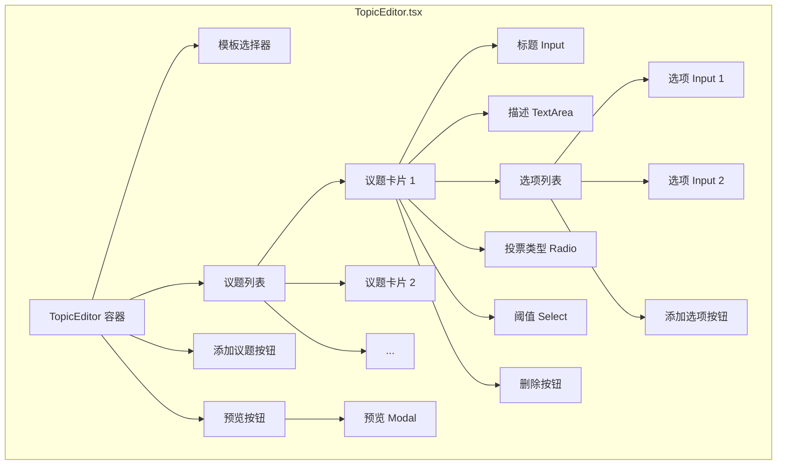

# 议题设置编辑器升级方案

## 1. 现状分析

当前在 [`AssemblyManage.tsx`](../property-management-system/src/pages/committee/AssemblyManage.tsx:254) 中，创建业主大会时的议题设置使用纯文本 `TextArea` 输入，格式为：

```
是否同意绿化改造方案|同意,不同意,弃权|单选|0.5
选举新一届业委会成员|张建国,李明华,王淑芳|多选|0.5
```

**问题：**
- 用户需要记忆复杂的格式规则（`|` 分隔、`,` 分隔选项）
- 无法直观地添加/删除/排序议题
- 无法动态增删改选项
- 没有预览功能，无法提前看到业主端的投票界面效果
- 容易因格式错误导致解析失败

## 2. 升级目标

参照竞品做法，将纯文本输入升级为**可视化议题编辑器**，提供卡片式编辑界面。

## 3. 技术方案

### 3.1 新建组件：`TopicEditor.tsx`

**路径：** [`property-management-system/src/components/TopicEditor.tsx`](../property-management-system/src/components/TopicEditor.tsx)

**Props 接口：**
```typescript
interface TopicEditorProps {
  value?: AssemblyTopic[];   // 受控值
  onChange?: (topics: AssemblyTopic[]) => void;  // 变更回调
}
```

**内部状态：**
- `topics: AssemblyTopic[]` — 议题列表
- `previewVisible: boolean` — 预览弹窗可见性

### 3.2 每个议题卡片的设计

每个议题以 **Ant Design Card** 呈现，包含以下字段：

| 字段 | 组件 | 说明 |
|------|------|------|
| 议题标题 | `Input` | 必填，placeholder: "如：是否同意绿化改造方案" |
| 议题描述 | `Input.TextArea` | 可选，placeholder: "补充说明（可选）" |
| 选项列表 | 动态 `Input` 列表 | 每个选项一个 Input，可编辑文本；支持添加/删除；最少2个选项 |
| 投票类型 | `Radio.Group` | 单选 / 多选 |
| 通过阈值 | `Select` | 1/2(50%)、3/5(60%)、2/3(66.7%)、3/4(75%)、4/5(80%) |
| 删除按钮 | `Button` danger | 删除该议题（至少保留1个） |

### 3.3 模板功能

提供预设模板，一键填充到当前议题：

| 模板名称 | 选项 | 投票类型 | 阈值 |
|----------|------|---------|------|
| 同意/不同意/弃权 | 同意, 不同意, 弃权 | 单选 | 1/2 |
| 赞成/反对/弃权 | 赞成, 反对, 弃权 | 单选 | 1/2 |
| 候选人选举 | 候选人A, 候选人B, 候选人C | 多选 | 1/2 |

### 3.4 预览功能

点击"预览"按钮打开 Modal，模拟业主端投票界面：
- 显示所有议题的标题和描述
- 每个议题显示选项（单选用 Radio，多选用 Checkbox）
- 显示投票类型标签和阈值信息
- 仅供查看，不可实际投票

### 3.5 与 Form 的集成

`TopicEditor` 遵循 Ant Design Form 的受控组件协议：
- 通过 `value` prop 接收外部数据
- 通过 `onChange` 回调通知外部数据变更
- 在 `Form.Item` 中直接使用 `TopicEditor` 组件

```tsx
<Form.Item name="topics" label="议题设置" rules={[{ required: true, message: '请添加至少一个议题' }]}>
  <TopicEditor />
</Form.Item>
```

### 3.6 修改 `AssemblyManage.tsx`

**变更点：**
1. 导入 `TopicEditor` 组件
2. 替换 `TextArea` 的 `Form.Item` 为 `TopicEditor`
3. 修改 `handleSave` 方法：直接从 `values.topics` 获取 `AssemblyTopic[]` 数据，无需解析文本
4. 移除 `TextArea` 导入（如果不再使用）

**handleSave 新逻辑：**
```typescript
const handleSave = async () => {
  const values = await form.validateFields();
  // values.topics 已经是 AssemblyTopic[] 类型，无需解析
  await createAssembly({ ...values, topics: values.topics });
  message.success('业主大会已创建');
  setModalVisible(false);
  loadData();
};
```

## 4. 交互流程

```mermaid
flowchart TD
    A[点击"发起业主大会"] --> B[弹窗显示表单]
    B --> C[填写基本信息]
    C --> D[议题设置区域]
    D --> E[默认显示一个议题卡片]
    E --> F{用户操作}
    F -->|修改标题| G[编辑标题 Input]
    F -->|添加描述| H[编辑描述 TextArea]
    F -->|编辑选项| I[增删改选项 Input]
    F -->|切换类型| J[单选/多选 Radio]
    F -->|选择阈值| K[Select 选择阈值]
    F -->|添加议题| L[新增议题卡片]
    F -->|删除议题| M[删除当前卡片]
    F -->|使用模板| N[选择模板填充]
    F -->|预览| O[打开预览弹窗]
    O --> P[查看业主端投票效果]
    P --> Q[关闭预览]
    G --> R[点击"确定"提交]
    I --> R
    L --> R
    N --> R
    R --> S[创建业主大会成功]
```

## 5. 组件结构图



## 6. 数据流

```mermaid
flowchart LR
    A[TopicEditor] -->|onChange: AssemblyTopic[]| B[Form.Item]
    B -->|form.getFieldsValue| C[handleSave]
    C -->|values.topics| D[createAssembly API]
    D --> E[committeeService.ts]
```

## 7. 文件变更清单

| 文件 | 操作 | 说明 |
|------|------|------|
| [`src/components/TopicEditor.tsx`](../property-management-system/src/components/TopicEditor.tsx) | **新建** | 可视化议题编辑器组件 |
| [`src/pages/committee/AssemblyManage.tsx`](../property-management-system/src/pages/committee/AssemblyManage.tsx) | **修改** | 集成 TopicEditor，替换 TextArea |

## 8. 无需变更的文件

| 文件 | 原因 |
|------|------|
| [`src/services/committeeService.ts`](../property-management-system/src/services/committeeService.ts) | `AssemblyTopic` 类型定义已满足需求，无需修改 |
| [`src/services/voteService.ts`](../property-management-system/src/services/voteService.ts) | 投票服务不受影响 |
| [`src/pages/owner/VotePage.tsx`](../property-management-system/src/pages/owner/VotePage.tsx) | 业主端投票页面不受影响 |
| [`src/router/index.tsx`](../property-management-system/src/router/index.tsx) | 路由配置不受影响 |

## 9. 验收标准

1. ✅ 创建业主大会弹窗中，议题设置区域显示为可视化编辑器，而非纯文本输入框
2. ✅ 默认显示一个议题卡片，包含标题、选项（同意/不同意/弃权）、单选、阈值50%
3. ✅ 可添加多个议题，每个议题可独立编辑标题、描述、选项、投票类型、阈值
4. ✅ 选项可动态添加和删除，最少保留2个
5. ✅ 议题可删除，至少保留1个
6. ✅ 提供模板快速填充功能
7. ✅ 提供预览功能，可查看业主端投票效果
8. ✅ 提交时数据格式正确，与 `AssemblyTopic[]` 类型兼容
9. ✅ 编译无报错
